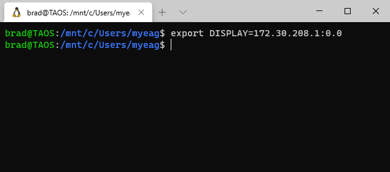
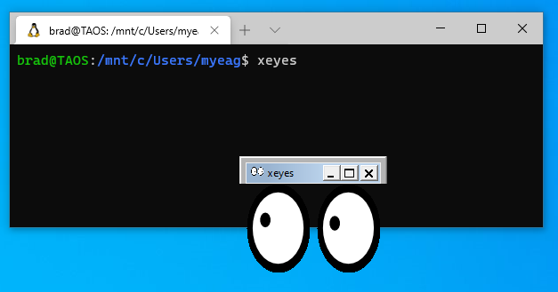
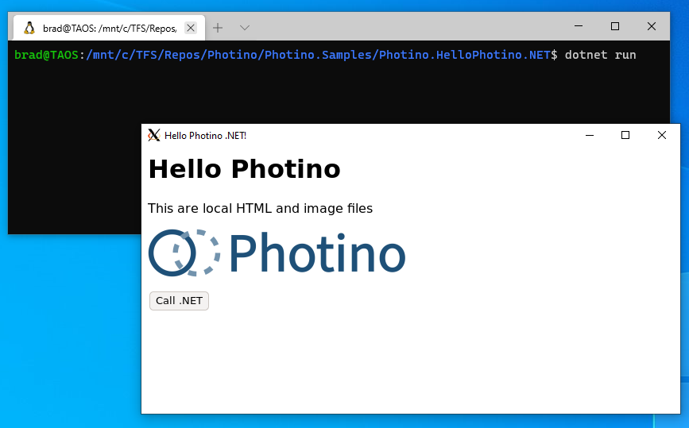

# Run Photino Apps in WSL2
Yes, you can test your Photino applications in Windows Subsystem for Linux (WSL)! We've tested with WSL2 and Ubuntu 20.04. While we don't officially support running Photino Linux apps in WSL2, we recognize that it is useful for testing and demos. It does require a little configuration however, because WSL does not have a graphical UI. To compensate, Linux has the X Window System, sometimes referred to as X11 or just X which provides for basic GUI functions. We've tested with an X Windows System for Windows named [Vcxsrv]("https://sourceforge.net/projects/vcxsrv/") which can be found on SourceForge. 
  

## Configure your machine
## Install VcXsrv
VcXsrv can be installed with a downloaded installer program obtained from the web page above. 

Once VcXsrv server has been installed and run on your Windows machine, you'll see the X Server icon in your system tray. Right-click and choose 'Show Log'. the last few lines of the log should look something like this: 

* winClipboardThreadProc - DISPLAY=127.0.0.1:0.0
* winClipboardProc - xcb_connect () returned and successfully opened the display.
* Using Composite redirection

From the context menu of the system tray icon, there is an Applications submenu from which you can launch xcalc, xclock, and xwininfo; Linux programs that display their GUIs on your Windows desktop.

## Set an Environment Variable in your WSL2 Shell
Open a command prompt or powershell prompt in Windows, type `ipconfig` and hit enter. Find the entry that reads: **Ethernet adapter vEthernet (WSL):** and make a note of the IPV4 address listed.

Next, open a WSL shell and enter: 
`export DISPLAY=XXX.XXX.XXX.XXX:0.0` 
where XXX.XXX.XXX.XXX is the IP address for your WSL vEthernet adapter. Note that most of the directions you'll find online for VcXsrv, XMing and other X Window Servers tell you to use 127.0.0.1 for the IP address. This does not work (at least not well) in WSL2.

You can test running apps from the WSL shell by installing some sample X Window apps: `sudo apt-get install x11-apps` and then running one of the apps: `xeyes`, which displays a Window with a title bar and a set of eyes that follow the cursor around.

You Photino apps will now run on your Windows desktop as well:

In order to save the `export DISPLAY=` command so that it's available every time you start WSL2, use your favorite text editor to edit the *.profile* file in the user's home folder. Since I have VS Code installed on my Windows machine (and not in WSL2), I just enter `code` at the shell prompt to start it up, then open a folder and type `/home/<username>`. Then select the .profile file to open it. Add the *export DISPLAY=XXX.XXX.XXX.XXX:0.0* command to the bottom of the file and save it.

